# Building Footprints: From Aerial Imagery to Usable Vectors

Extracting building footprints from 0.3 m aerial imagery and converting them into
clean, topologically valid polygons that hold up in a GIS workflow.

Segmenting buildings is a solved problem. The two questions worth asking are what
happens when you point the model at a region it has never seen, and whether the
thing it emits is a probability raster or something a surveyor can open. This
project is built around those, and around a second iteration that attacked the
failures the first one exposed.

**Headline: 0.7454 IoU on two regions held out entirely from training, up from
0.6957 in v1. The in-domain to out-of-domain gap narrowed from 0.111 to 0.082.**

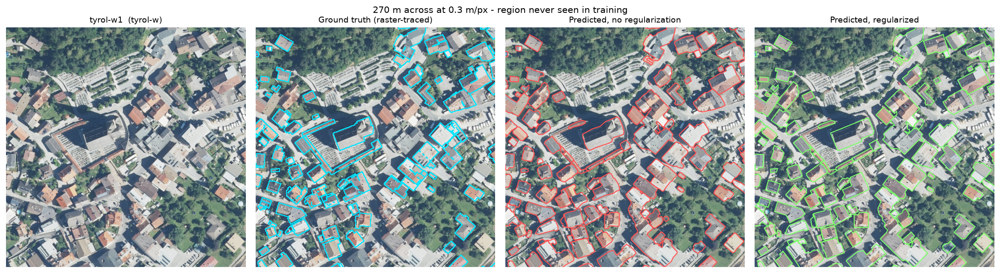

*Tyrol-w1, a region held out entirely from training. Cyan = ground truth,
red = raw model output, green = after orthogonal regularization.*

---

## Why the split is geographic

INRIA provides 180 labelled 5000×5000 px scenes at 0.3 m/px across five regions.
Most work on it splits tiles randomly, which lets a model train on one half of a
rooftop and be tested on the other. The resulting number is several points higher
and says nothing about deployment.

| split | regions | scenes |
|---|---|---|
| train | Austin, Chicago, Vienna | 90 |
| val | Austin, Chicago, Vienna | 18 |
| **test** | **Kitsap County, Tyrol-w** | **72** |

Kitsap is low-density North American suburbia under closed conifer canopy.
Tyrol-w is Alpine settlement: dense village cores and large industrial sheds.
Neither resembles the training cities, and they fail differently.

## v1 → v2

| metric | v1 | **v2** | change |
|---|---|---|---|
| **Pixel IoU, unseen regions** | 0.6957 | **0.7454** | **+0.050** |
| Kitsap | 0.6012 | **0.6639** | **+0.063** |
| Tyrol-w | 0.7775 | **0.8186** | +0.041 |
| Precision / Recall | 0.877 / 0.771 | 0.858 / **0.850** | recall **+0.079** |
| Boundary IoU @ 1 m | 0.2165 | **0.2407** | +0.024 |
| Instance F1 @ IoU 0.5 | 0.6019 | **0.6752** | **+0.073** |
| PoLiS median displacement | 0.85 m | 0.85 m | — |
| Buildings found (GT: 36,145) | 33,084 | **37,639** | count error 8.5% → 4.1% |
| In-domain IoU | 0.8066 | **0.8277** | +0.021 |
| **Generalization gap** | **0.111** | **0.082** | **−0.029** |

The gap closing by more than the in-domain score rose is the result I care about.
It means the changes improved *transfer*, not just capacity.

## What changed, and what it was worth

Techniques were selected on a **withheld training city (Vienna)**, never on the
test regions. Seven cumulative ablations, then three confirmation runs to
disentangle a rung that turned out to be harmful.

| change | effect on OOD IoU | verdict |
|---|---|---|
| SegFormer (MiT-B2) encoder | **+0.017** | clear win, and ~3× faster than ResNet-50 U-Net |
| Focal Tversky loss (β > α) | **+0.009** | clear win; recall 0.886 → 0.919 |
| Per-tile standardization | **+0.005** | small win |
| Excess-Green 4th channel | ±0.005 | within noise |
| Fourier style transfer | ±0.004 | within noise |
| Wide scale jitter 0.5–2.0× | **−0.022** | **actively harmful** |

Two things worth stating plainly.

**The largest single gain came from deleting something.** Removing the wide scale
jitter took the best configuration from 0.7534 to 0.7603. I had predicted it
would help, on the reasoning that the training cities contain few small
buildings. It made precision collapse from 0.793 to 0.762 instead.

**Three of the six changes are inside the noise floor.** Differences under ~0.005
on a single 15-epoch run with one seed are not real. ExG and FDA measured
positive in one arrangement and negative in another, which is what noise looks
like. They are in the final configuration because the highest-scoring combination
contained them, not because they are demonstrated improvements.

### Threshold calibration, before and after

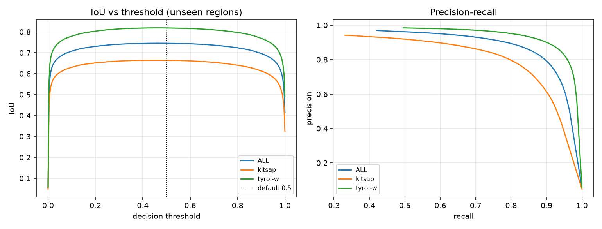

In v1 the optimal decision threshold sat at 0.25 overall and **0.18 for Kitsap**,
far below the 0.5 actually used: the model was systematically under-confident on
unfamiliar terrain, and most under-confident where the domain gap was widest.

In v2 all three curves are flat-topped across 0.40–0.55, with the default 0.5
sitting essentially on the optimum. Per-region calibration has stopped mattering.
For a deployment story that is worth more than the IoU gain, because it means one
fixed threshold transfers to regions you have no labels for.

> Per-region optima are reported as an oracle upper bound, not a result. Every
> headline number here uses a fixed 0.5 threshold. Tuning on the test set would
> be leakage.

## Results across the unseen regions

Every scene below is from Kitsap County or Tyrol-w, neither of which appears in
training in any form. Left to right: imagery, ground truth, raw model output,
regularized output.

### Kitsap County — forested low-density suburbia

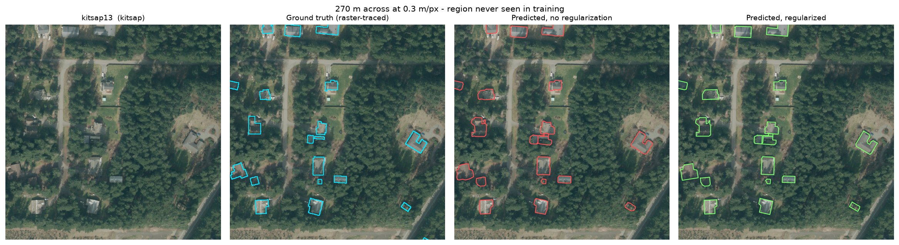
*kitsap13 — houses scattered under conifer canopy. Most structures are found;
the smallest outbuildings are not (see failure analysis).*

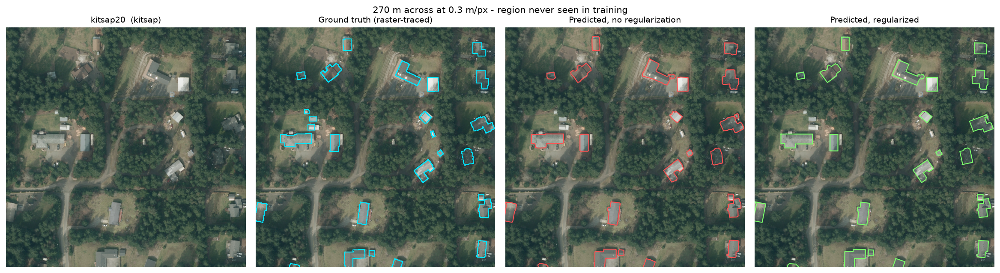
*kitsap20 — very low density, heavy shadow. Detection holds up in the open,
degrades where roofs sit under tree crowns.*

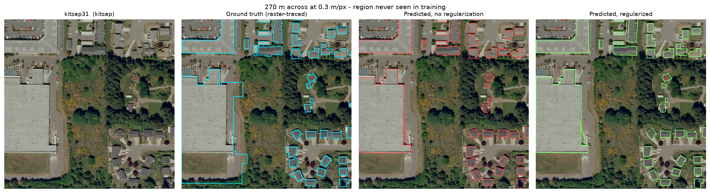
*kitsap31 — big-box retail beside suburban housing. The large roof, including
the stepped notch at its lower right, is followed accurately. Single-axis
buildings at this scale were a weakness in v1.*

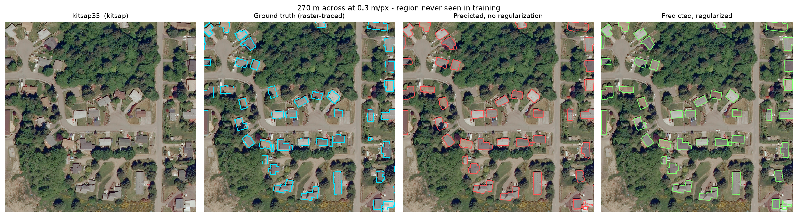
*kitsap35 — suburban streets threaded through woodland, roughly the hardest
density-versus-occlusion mix in the region.*

### Tyrol-w — Alpine village cores and valley-floor industry

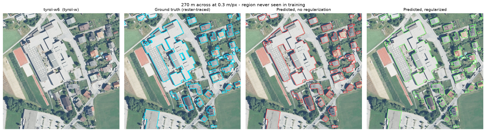
*tyrol-w6 — an institutional complex with wings at several orientations. This is
the case that should break a regularizer assuming one dominant axis per
building; the area-change guard keeps the oblique sections unsnapped rather than
distorting them.*

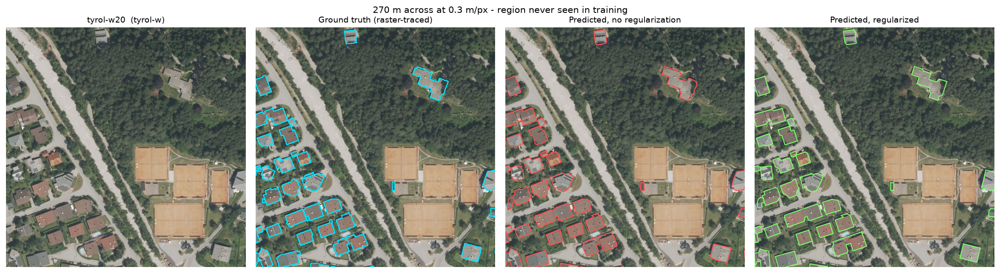
*tyrol-w20 — note the tennis courts. They are large, rectangular, flat and
high-contrast, and all of them are correctly rejected. A model that had learned
"big rectangle" rather than "building" would claim them.*

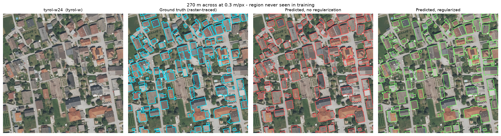
*tyrol-w24 — dense village core, the highest building density anywhere in the
test set, with courtyards and shared walls throughout.*

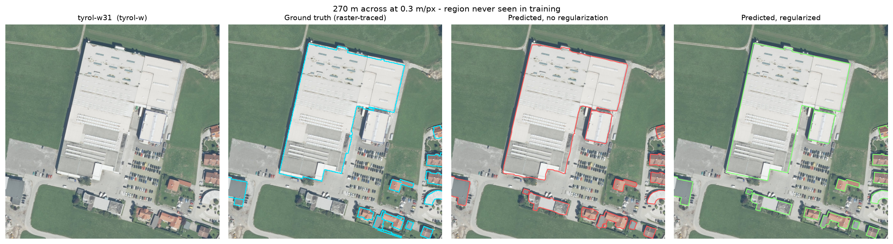
*tyrol-w31 — an isolated industrial building against open fields. Easy to detect,
hard to delineate: nearly all the error here is boundary placement rather than
detection, which is what Boundary IoU and PoLiS are for.*

Each crop is the densest 270 m window in its scene, selected automatically. That
biases the gallery toward busy areas; the failure analysis below is deliberately
not selected this way.

## Vector quality

Invisible to IoU, and the part that decides whether the output is usable.

| geometry | vertices/building | orthogonality |
|---|---|---|
| predicted, no regularization | 11.08 | 0.143 |
| **predicted, regularized** | **6.56** | **0.643** |
| ground truth, raster-traced | 65.38 | 1.000 |
| ground truth, simplified identically | 7.34 | 0.880 |

Regularization does not change which pixels are called building. IoU is
untouched. What changes is whether a GIS analyst can work with the result.

Read the two columns **together**. Ground truth traced straight off the label
raster inherits a pixel staircase, and every stair step is a perfect 90° corner —
so it scores 1.000 orthogonality at 65 vertices per building while being the
least usable geometry in the dataset. Orthogonality alone is a trap.

The regularizer estimates each building's dominant axis from a length-weighted
circular mean of edge orientations, rotates into that frame, and snaps *runs* of
consecutive near-axis edges to a shared coordinate, so a wall broken into three
segments by Douglas-Peucker becomes one line rather than a staircase. Edges more
than 20° off-axis are left alone, and an area-change guard reverts the operation
if it distorts a footprint by more than 25%.

## Evaluation

Pixel IoU is the number everyone reports and the least informative one. Also
measured:

- **Boundary IoU** at 1 m / 2 m / 3 m bands — size-insensitive, so it exposes
  systematic wall displacement that plain IoU hides. A single band width is
  uninterpretable: if it is narrower than the typical displacement the score
  collapses regardless of quality.
- **Instance metrics** — per-*polygon* precision/recall/F1 at IoU 0.25/0.5/0.75.
- **PoLiS** — mean vertex-to-boundary distance in metres, which is the question a
  surveyor actually asks. Median 0.85 m, under three pixels at this resolution.
- **Shape quality** — versus ground truth put through identical processing.

### A hypothesis I tested and refuted

INRIA labels are a binary raster, so a terrace of touching row houses is one
connected component. A model that *correctly* separates them is scored as several
false positives. I expected this to explain much of the error and built a
merge-tolerant matcher, where a ground-truth polygon counts as found if the union
of predictions inside it clears the threshold.

At IoU 0.5: **0.6752 strict against 0.7034 merge-tolerant.** Under three points.
The hypothesis does not hold — the dominant problem is recall, concentrated in
Kitsap. Reported rather than deleted, because a hypothesis tested and refuted is
more informative than one never tested.

## Failure analysis

Found by looking at outputs, not tables. The figures in this section are chosen
to show the failures, not to flatter the result.

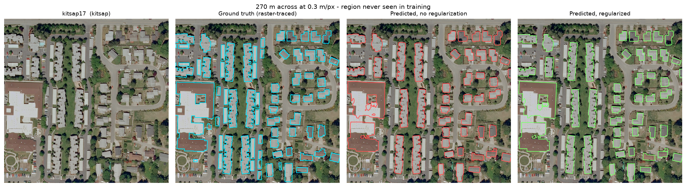

**Fixed in v2.** Rows of near-identical manufactured homes used to fuse into
single strips; they now separate into individual units. Far more of the small
suburban units are detected. This is where the recall gain came from.

**Also fixed.** Large industrial outlines in Tyrol used to wander along shadow
lines and come out visibly jagged. The regularizer now produces straight walls
that follow the actual roof edge.

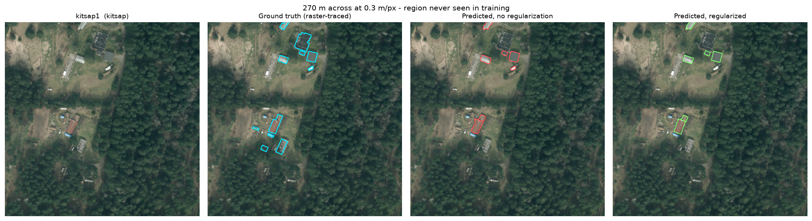

**Not fixed: small isolated outbuildings.** Ground truth marks nine structures in
this scene; the model finds about five. Sheds, detached garages and trailers
under roughly 50 m² are still missed. Recall improved on *dense* suburban units
but not on these. That is consistent with the cause: Austin, Chicago and Vienna
contain almost no buildings this small, so no loss reweighting can invent
training examples of a type the data does not have. The fix is a low-density
training region, not a better objective.

**Not fixable from RGB: labels encoding invisible information.** In `tyrol-w13`
and `tyrol-w17`, ground truth divides large industrial roofs along lines with no
counterpart in the imagery — almost certainly cadastral boundaries. No model
working from RGB alone can recover them, and it is a large part of why instance
F1 collapses to 0.31 at IoU 0.75. Resolving it needs parcel data or lidar, not a
better network.

## Limitations

- Techniques were selected on Vienna, which is an *easier* out-of-domain target
  than Kitsap: recall there was already above 0.90 in every ablation, against
  0.68 on Kitsap in v1. A gain measured on Vienna does not necessarily transfer.
  Using it anyway was the price of not selecting on the test set.
- The +0.050 test gain exceeds the +0.031 the ablations predicted. The final run
  also added a third training city, 4× the tiles and 4× the epochs, and those
  contributions cannot be cleanly separated from the technique changes.
- Single seed per configuration. Differences under ~0.005 are not resolvable.
- Precision fell slightly (0.877 → 0.858), the expected cost of a recall-weighted
  loss, and orthogonality fell from 0.689 to 0.643.
- No change detection between epochs, no roof-plane segmentation, no 3D.

## Reproducing

```bash
python -m src.data.make_tiles           --config configs/final.yaml --clean
python -m src.train.train               --config configs/final.yaml --name final
python -m src.inference.predict_scenes  --config configs/final.yaml \
        --checkpoint outputs/run_final/best.pth --tta
python -m src.vector.vectorize          --config configs/final.yaml
python -m src.eval.evaluate             --config configs/final.yaml
python -m src.eval.figures              --config configs/final.yaml
```

The ablation ladder is `python -m src.experiments.run_ablations`, with results in
`outputs/experiments/ablation_results.csv`. Every path, threshold and
hyperparameter lives in `configs/`.

Final model: SegFormer/MiT-B2, 24.7 M parameters, 60 epochs on 30,797 tiles,
~9 hours on an RTX 4080 SUPER. Inference runs at 6.9 s per 25 MP scene with
8-fold test-time augmentation.
